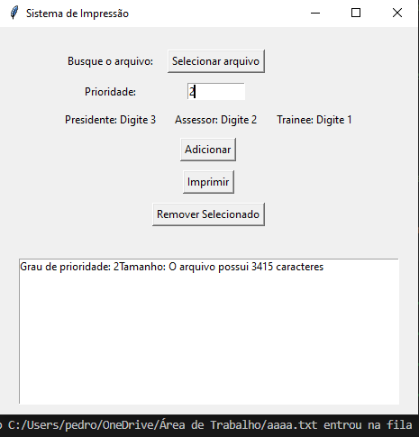
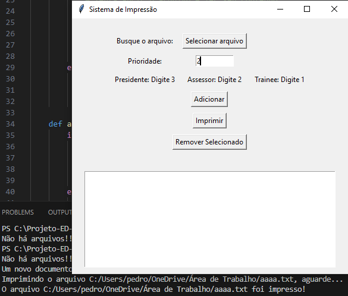

<h1>🖥️Simulador de Impressões</h1>

<h2>O que é?</h2>
O intuíto do trabalho era aplicar uma das estruturas de dados estudadas durante o semestre (2023.2) da Universidade de Brasília (UnB), no qual alunos dos cursos de Computação (Licenciatura) e Ciências da Computação (Bacharelado) fizeram parte da turma. Portanto, fizemos um Simulador de impressões aplicando a estrutura de uma lista duplamente encadeada na linguagem de programação Python.
<h2>Autores</h2>

* Pedro Augusto
* Vitor Ivan
* Jorge Lucas
<h2>Contexto de Aplicação</h2>
Para realizar a aplicação da estrutura, decidimos fazer esse simulador de impressões dentro de um ambiente empresarial, onde determinada empresa possuí 3 (três) cargos de funcionários e cada um deles possuí determinado nível de prioridade na fila de impressão, sendo quanto maior o número (de 1 a 3), maior a prioridade.
<h3>Cargos e prioridade</h3>

- `Presidente`: Nível 3
- `Assessor`: Nível 2
- `Trainee`: Nível 1
<h2>Estruturas de Dados Utilizadas</h2>
A estrutura de dados utilizada foi uma lista duplamente encadeada, onde cada nó guarda um arquivo.txt dentro de sí e realiza as operações conforme o funcionamento da própria estrutura, porém contendo a regra funcional da prioridade dos cargos dos funcionários. Já que a ideia era simular um gerenciamento de uma fila de impressões de uma empresa, a estrutura de uma lista duplamente encadeada era a mais viável para ser utilizada.
<h3>Operações</h3>

* Comportamento de fila
* Inserção ordenada
* Remoção
* Travessia/ Impressão
<h2>Instruções de Execução</h2>

- `Passo 1`: Executar o código python normalmente
- `Passo 2`: Após a execução do código, uma interface irá se abrir em modo janela.
<h2>Instruções de Uso</h2>
<h3>➕Adicionar arquivo</h3>

- `Passo 1`: Com a janela do programa aberta, clique em **"Selecionar arquivo"**
- `Passo 2`: A janela para selecionar um arquivo do próprio Windows será aberta
- `Passo 3`: Selecione um arquivo**.txt**
- `Passo 4`: Defina um nível de prioridade para a impressão do arquivo conforme a legenda
- `Passo 5`: Basta clicar em **"Adicionar"**
- `Passo 6`: Repita os passos anteriores até selecionar todos os arquivos desejados para simular a impressã
<h3>➖Remover Arquivo</h3>

- `Passo 1`: Selecione o arquivo que deseja remover
- `Passo 2`: Clique em **"Remover selecionado"**
- `Passo 3`: Uma janela irá abrir para avisar que o arquivo foi removido
<h3>🖨️Imprimir</h3>

- `Passo 1`: Adicione todos os arquivos desejados
- `Passo 2`: Clique em **"Imprimir"**
- `Passo 3`: A simulação da impressão começará no terminal do compilador
- `Passo 4`: Após o último arquivo ser "impresso", a fila de impressão é limpa
<h3>👁️‍🗨️Mídias</h3>
.

<h2>Referências</h2>

-`Documentação Python`: https://docs.python.org/3/

-`Documentação tkinter`: https://docs.python.org/3/library/tkinter.html

-`NeuralNine`: https://www.youtube.com/@NeuralNine

-`João Ribeiro`: https://www.youtube.com/@JLDRPT